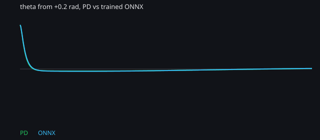

# PD vs behavior-cloned linear policy

`models/cartpole.onnx` is a linear policy trained by behavior cloning of the PD controller (`120θ + 20θ̇ + x + 2ẋ`), then clamped to ±20 N. The training script is `tools/train/train.py`. `crates/helm-modules/tests/fixtures/cartpole_test.onnx` stays a unit-test stand-in.

Training stopped at step 3703 when 10 eval episodes from `|θ|` in `[0.03, 0.08]` rad stayed inside `|θ| < 0.2` for 500 steps and the force error against PD was under 0.5 N. The largest grid error at that checkpoint was about 0.50 N at `|θ| = 0.08`.

The bench runs both controllers in-process on the same cart-pole, `dt = 10 ms`, 10 s, other state 0. Success means `|θ| < 1°` for 1 s before t = 10 s. Settling time is when that window first completes. Overshoot is the peak `|θ|` after the first zero crossing. Effort is `Σ F² dt`. Saturation is the fraction of ticks with `|F| >= 20 N`.

```bash
cargo run -p compare-controllers -- --metrics docs/pd_vs_onnx.csv --trace docs/pd_vs_onnx_trace.csv
python3 tools/plot_pd_vs_onnx.py
```

Both balance every initial condition below. The fitted gains are slightly smaller than the PD gains, so effort is a bit lower and settling is a few hundredths of a second later.

| controller | theta0 (rad) | success | settle (s) | overshoot (rad) | effort | peak \|F\| (N) | sat |
| --- | ---: | --- | ---: | ---: | ---: | ---: | ---: |
| pd | 0.05 | yes | 1.17 | 0.0023 | 0.804 | 6.00 | 0.000 |
| onnx | 0.05 | yes | 1.18 | 0.0025 | 0.726 | 5.69 | 0.000 |
| pd | -0.05 | yes | 1.17 | 0.0023 | 0.804 | 6.00 | 0.000 |
| onnx | -0.05 | yes | 1.18 | 0.0025 | 0.725 | 5.69 | 0.000 |
| pd | 0.10 | yes | 1.25 | 0.0046 | 3.226 | 12.00 | 0.000 |
| onnx | 0.10 | yes | 1.26 | 0.0051 | 2.913 | 11.38 | 0.000 |
| pd | -0.10 | yes | 1.25 | 0.0046 | 3.226 | 12.00 | 0.000 |
| onnx | -0.10 | yes | 1.26 | 0.0051 | 2.912 | 11.38 | 0.000 |
| pd | 0.20 | yes | 1.32 | 0.0096 | 12.252 | 20.00 | 0.001 |
| onnx | 0.20 | yes | 1.34 | 0.0105 | 11.247 | 20.00 | 0.001 |
| pd | -0.20 | yes | 1.32 | 0.0096 | 12.252 | 20.00 | 0.001 |
| onnx | -0.20 | yes | 1.34 | 0.0105 | 11.245 | 20.00 | 0.001 |


